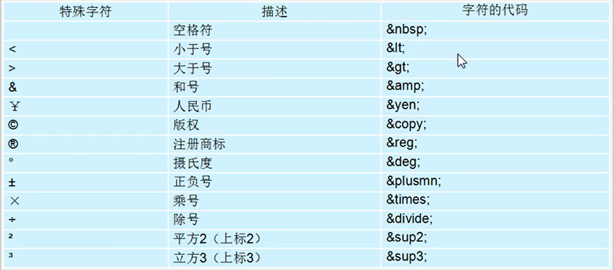
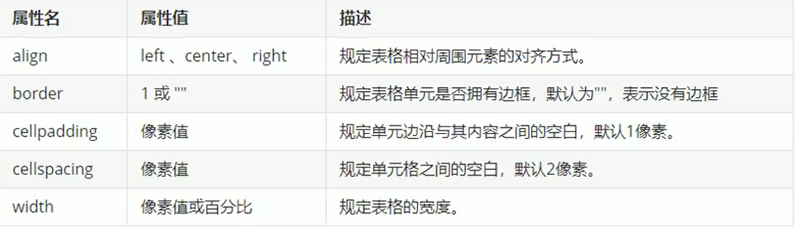
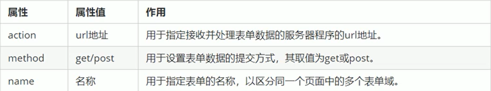
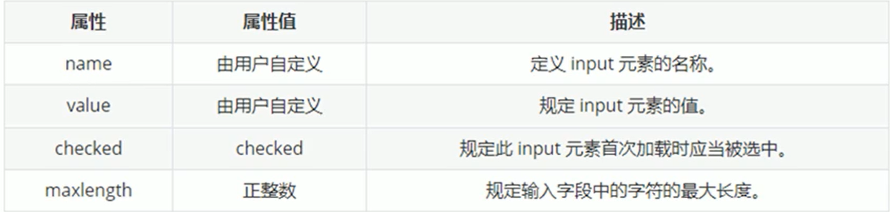

# HTML-CSS 基础到进阶

## HTML

### 1. 常用浏览器及其内核

#### 1. 常用浏览器：

* IE
* 火狐（FireFox）
* 谷歌（Chrome）
* Safari
* Opera

#### 2. 浏览器内核：

* IE：Trident
* firefox:Gecko
* Safari:Webkit
* Chrome/Opera:Blink(Blink 是 Webkit 分支)

### 2. HTML 标签

#### 2.1 HTML 语法规范

##### 2.1.1 基本语法

* HTML 标签**由尖括号包围的关键词，**例如：<button>
* HTML 标签成对出现，双标签，例如：<burron></button>
* HTML 标签特殊情况，单标签，例如：<br />

##### 2.1.2 标签关系

**双标签关系分两类：**包含关系、并列关系

* 包含关系

  ```javascript
  <div>
    <span></span>
  </div>
  ```

* 并列关系

  ```javascript
  <div>第一个标签</div>
  <div>第二个标签</div>
  ```

#### 2.2 HTML 基本结构标签

* 例子：<html></html>，HTML 标签，页面中最大标签，根标签

* 例子：<head> </head>，文档头部，head 标签中必须设置 title 标签

* 例子：<title></title>，文档标题，页面标题

* 例子：<body></body>，文档主体，页面内容基本都放在 body 里面

* HTML  文档后缀必须是 .html 或 .htm 

#### 2.3 HTML 常用标签

##### 2.3.1 标签语义

* 记住标签的含义，知道每个标签作用
* 根据标签含义，在合适的位置放入最合理的标签，让页面结构更加清晰

##### 2.3.2 标题标签 h1 — h6 （重要）

* 标签：<h1> — <h6>，h1 最大、h6 最小
* 标签语义：作为标题使用，依据重要性递减

**特点：**

* 加了标题的文字，字体变粗，字号变大 
* 一个标签独占一行

##### 2.3.3 段落和换行标签（重要）

**段落标签：**

* 段落标签：<p>

* 标签语义：把 HTML 文档分割为若干段落

  **特点：**

  * 文本在一个段落中会根据浏览器窗口大小进行自动换行
  * 段落与段落之间有空隙

**换行标签：**

* 换行标签：<br/>

* 标签语义：将文本强制换行显示

  **特点：**

  * 换行标签是单标签
  * 换行标签只是简单开始新的一行，与段落不一样，段落之间会插入空隙，换行标签没有空隙

##### 2.3.4 文本格式化标签

* 文字设置:**粗体、斜体、下划线**等效果
* 标签语义：突出重要性
* 加粗：<strong></strong>
* 倾斜：<em></em>
* 删除线：<del></del>
* 下划线：<ins></ins>

##### 2.3.5 div 标签 和 span 标签（重要）

**div 标签** 和 **span 标签**没有语义，它们是一个盒子，用来装内容

**特点：**

* div 标签：用来布局，一行只能放一个 div 标签。大盒子
* span 标签：用来布局，一行可以放多个 span 标签。小盒子

##### 2.3.6 图像标签和路径（重要）

**图像标签：**

* 图像标签：

  **特点：**

  * img 标签是单标签
  * src 属性（必选）：指定图像路径
  * alt 属性：图像不能显示的替换文本
  * title 属性：鼠标放图片上时的提示文本
  * width 属性：图像宽度
  * height 属性：图像高度
  * border 属性：图像边框粗细

**路径**

* 目录文件夹和根目录
  * 目录文件夹：普通文件夹，只是存放了页面相关文件
  * 根目录：目录文件夹的第一层

* VSCode 打开目录文件夹
  * 把目录文件夹放入 VSCode，便于管理文件

**1. 相对路径**（重要）

* 以**引用文件所在位置**为参考基础，而建立出的目录路径
* 相对路径：从代码所在文件出发，去寻找目标文件
* 同一级路径：（直接写需要引用的文件名字），例子：
* 下一级路径：  / ，例子：
* 上一级目录：../ ，例子：

**2. 绝对路径**（用的少）

* 绝对路径：目录下的绝对位置，直达目标位置，通常从盘符开始的路径
* 例子：' D:web\img\img1.png ' 或完整的网络地址 ' https://img0.baidu.com/it/u=3180525929,1578840005&fm=26&fmt=auto '

##### 2.3.7 超链接标签（重要）

* 超链接标签：<a></a>
* 作用：从一个页面链接到另一个页面

**链接语法格式：**

* 例子：<a href='跳转目标' target='目标窗口的弹出方式'></a>  标签内放入文本或图像
* href 属性（必选）：指定链接目标 url 地址
* target 属性：指定链接页面打开方式，_ self 为默认值，_ blank 为在新窗口中打开方式

**链接分类：**

* 外部链接：访问外部网站，例子：<a href = ' http://www.baidu.com '></a>
* 内部链接：网站内部网页互相链接，直接链接页面文件名称，例子：<a href = 'index.html'></a>
* 空链接：如果当时没有确定链接目标时，例子：<a href = '#'></a>
* 下载链接：如果 href 里面地址是一个文件或者压缩包，会下载该文件
* 网页元素链接：如文本、图像、表格、音频、视频等都可以添加超链接
* 锚点链接：点击链接，快速定位到页面中的某个位置
  * 链接文本 href 属性中，设置属性值为 **#名字** 形式，例子：<a href = '#two'></a>
  * 找到目标位置标签，添加 id 属性 = 上面的名字，例子<h1 id = 'two'>第二集</h1>

#### 2.4 HTML 中的注释和特殊字符

##### 2.4.1 注释标签

* 注释标签：便于阅读和理解但却不需要显示在页面中的注释文字
* 注释格式：<!-- 注释语句 -->
* 快捷键：ctrl + /
* 建议：要有良好的注释习惯，便于自己或者他人观看代码

##### 2.4.2 特殊字符

* 空格符: `&nbsp;`

* 小于号：`&lt;`

* 大于号：`&gt;`

  等等

**特殊字符列表：**



#### 2.5 HTML 开发常用标签

##### 2.5.1 表格标签

###### (1) 表格主要作用：

* 作用：展示数据
* 优点：数据整齐，可读性好

###### (2) 表格基本语法：

```html
<table>
  <tr>
    <td>单元格文字1</td>
    <td>单元格文字2</td>
  </tr>
  <tr>
    ...
  </tr>
</table>
```

* `<table></table>`：定义表格的标签
* `<tr></tr>`：定义表格中行的标签，必须嵌套在`<table></table>`
* `<td></td>`：定义表格中单元格的标签（表格内容—文字、链接、图片等），必须嵌套在`<tr></tr>`

###### (3) 表头单元格标签：

* 表头单元格标签：`<th></th>`，必须嵌套在`<tr></tr>`
*  作用：表头单元格也是属于单元格，常位于表格的第一行或者第一列，突出该单元格重要性，文字加粗居中显示

###### (4) 表格属性：

* align 属性：对齐方式

* border 属性：边框样式

* cellpadding 属性：单元格与内容间距

* cellspacing 属性：单元格与单元格间距

* width 属性：表格宽度

  

###### (5) 表格结构标签：

* 表格头部区域标签：`<thead>`，定义表格头部，`<thead>`标签内部必须有`<tr>`标签。一般位于第一行
* 表格主体区域标签：`<tbody>`，定义表格主体，主要用于放数据主体
* `<thead>`标签和`<tbody>`标签都放在`<table>`标签内部
* 作用：更好的表示表格语义，让表格结构更清晰

###### (6) 合并单元格

**合并单元格方式**

* 跨行合并：rowspan = ' 合并单元格个数 '
* 跨列合并：colspan  = ' 合并单元格个数 '

**目标单元格(写合并代码)**

* 跨列：最上侧单元格为目标单元格，写合并代码
* 跨行：最左侧单元格为目标单元格，写合并代码

**合并单元格步骤**

1.  先确定是跨行还是跨列合并
2.  找到目标单元格，写上合并方式 = 合并单元格数量，例子：`<td colspan = '2'></td>`
3. 删除多余单元格

##### 2.5.2 列表标签

* 作用：页面布局
* 优点：整齐、整洁，更加方便布局

###### (1) 无序列表（重要）

* 无序列表标签：`<ul></ul>`
* 列表项标签：`<li></li>`

**注意：**

1.  无序列表的列表项之间是并列关系，没有顺序之分
2. `<ul></ul>`内只能包含`<li></li>`
3.  `<li></li>`标签相当于一个容器，可以放所有类型元素
4. 无序列表带有自己样式属性

###### (2) 有序列表

* 有序列表标签：`<ol></ol>`
* 无序列表标签：`<li></li>`

**注意：**

1.  有序列表的列表项按照一定顺序进行排列
2.  `<ol></ol>`内只能包含`<li></li>`
3. `<li></li>`标签相当于一个容器，可以放所有类型元素
4. 有序列表带有自己样式属性

###### (3) 自定义列表（重要）

* 使用场景：常用于对术语或名词进行解释和描述
* 自定义列表标签：`<dl></dl>`
* 列表表头标签：`<dt></dt>`，定义项目/名字
* 列表项标签：`<dd></dd>`，描述项目/名字

**注意：**

1. `<dl></dl>`内只能包含`<dt>`和`<dd>`
2.  `<dt>`和`<dd>`个数没有限制，经常是一个`<dt>`对应多个`<dd>`

##### 2.5.3 表单标签

###### (1) 为何需要表单

* 目的：收集用户信息
* 例子：在网页中，需要跟用户进行交互，收集用户资料，此时就需要表单

###### (2) 表单组成

* 组成：表单域、表单控件、提示信息

**表单域：**

* 表单域：包含表单元素的区域

* 表单域标签：`<from>`，定义表单域，实现用户信息收集和传递

* 作用：`form`会把它范围内的表单元素信息提交到服务器

* 表单代码格式(伪代码)：

  ```html
  <form action='url地址' method='提交方式' name='表单域名称'>
    各种表单控件
  </form>
  ```

  常用属性：

  action：服务器程序 url 地址

  method：表单数据提交方式

  name：指定表单名称

  

**表单控件：**

* 表单控件：允许用户在表单中输入或选择的内容控件

  1.  input 输入表单元素

     * 输入表单标签（单标签）：`<input>`，用于收集用户信息

     * type 属性：不同的 **type** 属性值，输入字段有不同的形式（文本字段、复选框、单选按钮等）

     * 例子：`<input type='属性值 />`

     * type 属性值列表：

       

     * 其他属性：

       

       * name 和 value 是每个表单元素都有的属性值，主要给后端使用
       * name 是表单元素的名字，**单选按钮和复选按钮都要有相同的 name 值**
       * 单选和多选按钮，可以设置 checked 属性，保证默认选中状态

     * `<label>`标签

       * `<label>`标签为 input 元素定义标签

       * 作用：绑定一个表单元素，当点击`<label>`标签内文本，浏览器自动将光标移动或选择到对应表单元素上，增加用户体验

       * 语法：

         ```html
         // 例子
         <label for='sex'>男</label>
         <input type='radio' name='sex' id='sex' />
         ```

       * 核心：`<label>`标签 **for 属性**必须与相关元素的**id 属性相同**

         

  2.  select 下拉表单元素

     * 使用场景：页面中，有多个选项让用户选择，并且想要节约页面空间

     * 语法：

       ```html
       // 例子
       <select>
         <option>选项1</option>
         <option>选项2</option>
         <option>选项3</option>
       </select>
       ```

     * `<select>`至少包含一对`<option>`

     * `<option>`中定义`selected = 'selected'`，当前选项为**默认选项**

  3.  textarea 文本域元素

     * 使用场景：用户输入内容较多的情况（常见于留言板、评论等）

     * 文本域标签：`<textarea>`，定义多行文本输入的控件

     * 作用：输入更多文字内容

     * 语法：

       ```html
       // 例子
       <textarea rows='3' cols='20'>
         文本域内容
       </textarea>
       ```

     * cols 属性：每行文字的字数

     * rows 属性：文本域的行数

## CSS

