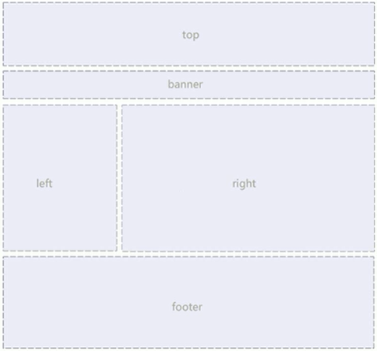

# HTML-CSS 基础到进阶

## 一、HTML  从入门到精通

### 1. 常用浏览器及其内核

#### 1.1 常用浏览器

* IE
* 火狐（FireFox）
* 谷歌（Chrome）
* Safari
* Opera

#### 1.2 浏览器内核

* IE：Trident
* firefox：Gecko
* Safari：Webkit
* Chrome/Opera：Blink(Blink 是 Webkit 分支)

### 2. HTML 标签

#### 2.1 HTML 语法规范

##### 2.1.1 基本语法

* HTML 标签**由尖括号包围的关键词，**例如：`<button>`
* HTML 标签成对出现，双标签，例如：`<burron></button>`
* HTML 标签特殊情况，单标签，例如：`<br />`

##### 2.1.2 标签关系

**双标签关系分两类：**包含关系、并列关系

* 包含关系

  ```javascript
  <div>
    <span></span>
  </div>
  ```

* 并列关系

  ```javascript
  <div>第一个标签</div>
  <div>第二个标签</div>
  ```

#### 2.2 HTML 基本结构标签

* 例子：`<html></html>`，HTML 标签，页面中最大标签，根标签

* 例子：`<head> </head>`，文档头部，head 标签中必须设置 title 标签

* 例子：`<title></title>`，文档标题，页面标题

* 例子：`<body></body>`，文档主体，页面内容基本都放在 body 里面

* HTML  文档后缀必须是 .html 或 .htm 

#### 2.3 HTML 常用标签

##### 2.3.1 标签语义

* 记住标签的含义，知道每个标签作用
* 根据标签含义，在合适的位置放入最合理的标签，让页面结构更加清晰

##### 2.3.2 标题标签 h1 — h6 （重要）

* 标签：`<h1> — <h6>`，h1 最大、h6 最小
* 标签语义：作为标题使用，依据重要性递减

**特点：**

* 加了标题的文字，字体变粗，字号变大 
* 一个标签独占一行

##### 2.3.3 段落和换行标签（重要）

**段落标签：**

* 段落标签：`<p>`

* 标签语义：把 HTML 文档分割为若干段落

  **特点：**

  * 文本在一个段落中会根据浏览器窗口大小进行自动换行
  * 段落与段落之间有空隙

**换行标签：**

* 换行标签：`<br/>`

* 标签语义：将文本强制换行显示

  **特点：**

  * 换行标签是单标签
  * 换行标签只是简单开始新的一行，与段落不一样，段落之间会插入空隙，换行标签没有空隙

##### 2.3.4 文本格式化标签

* 文字设置:**粗体、斜体、下划线**等效果
* 标签语义：突出重要性
* 加粗：`<strong></strong>`
* 倾斜：`<em></em>`
* 删除线：`<del></del>`
* 下划线：`<ins></ins>`

##### 2.3.5 div 标签 和 span 标签（重要）

**div 标签** 和 **span 标签**没有语义，它们是一个盒子，用来装内容

**特点：**

* div 标签：用来布局，一行只能放一个 div 标签。大盒子
* span 标签：用来布局，一行可以放多个 span 标签。小盒子

##### 2.3.6 图像标签和路径（重要）

**图像标签：**

* 图像标签：``

  **特点：**

  * img 标签是单标签
  * src 属性（必选）：指定图像路径
  * alt 属性：图像不能显示的替换文本
  * title 属性：鼠标放图片上时的提示文本
  * width 属性：图像宽度
  * height 属性：图像高度
  * border 属性：图像边框粗细

**路径**

* 目录文件夹和根目录
  * 目录文件夹：普通文件夹，只是存放了页面相关文件
  * 根目录：目录文件夹的第一层


**1. 相对路径**（重要）

* 以**引用文件所在位置**为参考基础，而建立出的目录路径
* 相对路径：从代码所在文件出发，去寻找目标文件
* 同一级路径：（直接写需要引用的文件名字），例子：``
* 下一级路径：  / ，例子：``
* 上一级目录：../ ，例子：``

**2. 绝对路径**（用的少）

* 绝对路径：目录下的绝对位置，直达目标位置，通常从盘符开始的路径
* 例子：' D:web\img\img1.png ' 或完整的网络地址 ' https://img0.baidu.com/it/u=3180525929,1578840005&fm=26&fmt=auto '

##### 2.3.7 超链接标签（重要）

* 超链接标签：`<a></a>`
* 作用：从一个页面链接到另一个页面

**链接语法格式：**

* 例子：`<a href='跳转目标' target='目标窗口的弹出方式'></a> ` 标签内放入文本或图像
* href 属性（必选）：指定链接目标 url 地址
* target 属性：指定链接页面打开方式，_ self 为默认值，_ blank 为在新窗口中打开方式

**链接分类：**

* 外部链接：访问外部网站，例子：`<a href = ' http://www.baidu.com '></a>`
* 内部链接：网站内部网页互相链接，直接链接页面文件名称，例子：`<a href = 'index.html'></a>`
* 空链接：如果当时没有确定链接目标时，例子：`<a href = '#'></a>`
* 下载链接：如果 href 里面地址是一个文件或者压缩包，会下载该文件
* 网页元素链接：如文本、图像、表格、音频、视频等都可以添加超链接
* 锚点链接：点击链接，快速定位到页面中的某个位置
  * 链接文本 href 属性中，设置属性值为 **#名字** 形式，例子：`<a href = '#two'></a>`
  * 找到目标位置标签，添加 id 属性 = 上面的名字，例子`<h1 id = 'two'>第二集</h1>`

#### 2.4 HTML 中的注释和特殊字符

##### 2.4.1 注释标签

* 注释标签：便于阅读和理解但却不需要显示在页面中的注释文字
* 注释格式：<!-- 注释语句 -->
* 快捷键：ctrl + /
* 建议：要有良好的注释习惯，便于自己或者他人观看代码

##### 2.4.2 特殊字符

* 空格符: `&nbsp;`

* 小于号：`&lt;`

* 大于号：`&gt;`

  等等

**特殊字符列表：**


#### 2.5 HTML 开发常用标签

##### 2.5.1 表格标签

###### (1) 表格主要作用：

* 作用：展示数据
* 优点：数据整齐，可读性好

###### (2) 表格基本语法：

```html
<table>
  <tr>
    <td>单元格文字1</td>
    <td>单元格文字2</td>
  </tr>
  <tr>
    ...
  </tr>
</table>
```

* `<table></table>`：定义表格的标签
* `<tr></tr>`：定义表格中行的标签，必须嵌套在`<table></table>`
* `<td></td>`：定义表格中单元格的标签（表格内容—文字、链接、图片等），必须嵌套在`<tr></tr>`

###### (3) 表头单元格标签：

* 表头单元格标签：`<th></th>`，必须嵌套在`<tr></tr>`
*  作用：表头单元格也是属于单元格，常位于表格的第一行或者第一列，突出该单元格重要性，文字加粗居中显示

###### (4) 表格属性：

* align 属性：对齐方式

* border 属性：边框样式

* cellpadding 属性：单元格与内容间距

* cellspacing 属性：单元格与单元格间距

* width 属性：表格宽度

  

###### (5) 表格结构标签：

* 表格头部区域标签：`<thead>`，定义表格头部，`<thead>`标签内部必须有`<tr>`标签。一般位于第一行
* 表格主体区域标签：`<tbody>`，定义表格主体，主要用于放数据主体
* `<thead>`标签和`<tbody>`标签都放在`<table>`标签内部
* 作用：更好的表示表格语义，让表格结构更清晰

###### (6) 合并单元格

**合并单元格方式**

* 跨行合并：rowspan = ' 合并单元格个数 '
* 跨列合并：colspan  = ' 合并单元格个数 '

**目标单元格(写合并代码)**

* 跨列：最上侧单元格为目标单元格，写合并代码
* 跨行：最左侧单元格为目标单元格，写合并代码

**合并单元格步骤**

1.  先确定是跨行还是跨列合并
2.  找到目标单元格，写上合并方式 = 合并单元格数量，例子：`<td colspan = '2'></td>`
3. 删除多余单元格

##### 2.5.2 列表标签

* 作用：页面布局
* 优点：整齐、整洁，更加方便布局

###### (1) 无序列表（重要）

* 无序列表标签：`<ul></ul>`
* 列表项标签：`<li></li>`

**注意：**

1.  无序列表的列表项之间是并列关系，没有顺序之分
2. `<ul></ul>`内只能包含`<li></li>`
3.  `<li></li>`标签相当于一个容器，可以放所有类型元素
4. 无序列表带有自己样式属性

###### (2) 有序列表

* 有序列表标签：`<ol></ol>`
* 无序列表标签：`<li></li>`

**注意：**

1.  有序列表的列表项按照一定顺序进行排列
2.  `<ol></ol>`内只能包含`<li></li>`
3. `<li></li>`标签相当于一个容器，可以放所有类型元素
4. 有序列表带有自己样式属性

###### (3) 自定义列表（重要）

* 使用场景：常用于对术语或名词进行解释和描述
* 自定义列表标签：`<dl></dl>`
* 列表表头标签：`<dt></dt>`，定义项目/名字
* 列表项标签：`<dd></dd>`，描述项目/名字

**注意：**

1. `<dl></dl>`内只能包含`<dt>`和`<dd>`
2.  `<dt>`和`<dd>`个数没有限制，经常是一个`<dt>`对应多个`<dd>`

##### 2.5.3 表单标签

###### (1) 为何需要表单

* 目的：收集用户信息
* 例子：在网页中，需要跟用户进行交互，收集用户资料，此时就需要表单

###### (2) 表单组成

* 组成：表单域、表单控件、提示信息

**表单域：**

* 表单域：包含表单元素的区域

* 表单域标签：`<from>`，定义表单域，实现用户信息收集和传递

* 作用：`form`会把它范围内的表单元素信息提交到服务器

* 表单代码格式(伪代码)：

  ```html
  <form action='url地址' method='提交方式' name='表单域名称'>
    各种表单控件
  </form>
  ```

  常用属性：

  action：服务器程序 url 地址

  method：表单数据提交方式

  name：指定表单名称

  

**表单控件：**

* 表单控件：允许用户在表单中输入或选择的内容控件

  1.  input 输入表单元素

     * 输入表单标签（单标签）：`<input>`，用于收集用户信息

     * type 属性：不同的 **type** 属性值，输入字段有不同的形式（文本字段、复选框、单选按钮等）

     * 例子：`<input type='属性值 />`

     * type 属性值列表：

       

     * 其他属性：

       

       * name 和 value 是每个表单元素都有的属性值，主要给后端使用
       * name 是表单元素的名字，**单选按钮和复选按钮都要有相同的 name 值**
       * 单选和多选按钮，可以设置 checked 属性，保证默认选中状态

     * `<label>`标签

       * `<label>`标签为 input 元素定义标签

       * 作用：绑定一个表单元素，当点击`<label>`标签内文本，浏览器自动将光标移动或选择到对应表单元素上，增加用户体验

       * 语法：

         ```html
         <label for='sex'>男</label>
         <input type='radio' name='sex' id='sex' />
         ```
         
   * 核心：`<label>`标签 **for 属性**必须与相关元素的**id 属性相同**
     
2.  select 下拉表单元素
  
   * 使用场景：页面中，有多个选项让用户选择，并且想要节约页面空间
   
   * 语法：
   
     ```html
       <select>
         <option>选项1</option>
         <option>选项2</option>
         <option>选项3</option>
       </select>
     ```
     
     * `<select>`至少包含一对`<option>`
   
     * `<option>`中定义`selected = 'selected'`，当前选项为**默认选项**
   
  3.  textarea 文本域元素

     * 使用场景：用户输入内容较多的情况（常见于留言板、评论等）

     * 文本域标签：`<textarea>`，定义多行文本输入的控件

     * 作用：输入更多文字内容

     * 语法：
     
       ```
       <textarea rows='3' cols='20'>
                  文本域内容
         </textarea>
       ```
  * rows 属性：文本域的行数
* cols 属性：每行文字的字数

<hr/>

## 二、CSS  基础

### 1. CSS 简介

### 2. CSS 基础选择器

### 3. CSS 字体属性

### 4. CSS 文本属性

<hr>

### 5. CSS 引入方式

#### (1) 内部样式表

* 内部样式表：写到 html 页面内部，将所有 CSS 代码抽取出来，单独放到一个 `<style>` 标签中
* `<style>` 标签理论上可以放在 HTML 文档的任何位置，但是一般放在文档 `<head>` 标签中
* 方便控制当前整个页面样式
* 代码结构清晰，但是没有完全实现结构和样式完全分离
* 内部样式表也称**嵌入式引入**，练习时常用

#### (2) 行内样式表

* 行内样式表：元素标签内部的 style 属性中设置 CSS 样式，适用于修改简单样式
* style 是标签属性，在双引号中间，写法要符合 CSS 规范，控制当前标签样式
* 建议少用：书写繁琐，且没有体现出结构和样式分离的思想，不推荐大量使用，只有对标签修改简单样式时，才考虑使用
* 行内样式表，也称**行内式引入**

#### (3) 外部样式表（重要）

* 实际开发中，使用最多的是外部样式表，适用于样式比较多的情况

* 核心：样式单独写到 CSS 文件中，之后把 CSS 文件引入 HTML 页面中使用

* 引入外部样式表步骤：

  * 新建 .css 样式文件，把所有 CSS 代码都放在该文件中

  * 在 HTML 页面中，使用 `<link>` 标签引入该文件

    `<link rel="stylesheet" href="css文件路径">`

  * rel 属性：定义当前文档与被链接文档之间的关系；这里需要指定为 ‘stylesheet’，表示被链接文档是一个样式表文件

  * href 属性：定义所链接外部样式表文件的 url，相对路径或绝对路径都可以

  * 外部样式表，也称**外链式**或**链接式引入**，该方式**开发中常用**

#### (4) CSS 引入方式总结

|   样式表   |           优点           |     缺点     | 使用情况 | 控制范围 |
| :--------: | :----------------------: | :----------: | :------: | :------: |
| 行内样式表 |     书写方便，权重高     | 结构样式混写 |   较少   | 一个标签 |
| 内部样式表 |   部分结构和样式相分离   | 没有彻底分离 |   较多   | 一个页面 |
| 外部样式表 | 完全实现结构和样式相分离 |   需要引入   |   最多   | 多个页面 |

 ### 6. Emmet 语法

#### 6.1 快速生成 HTML 结构语法


#### 6.2 快速生成 CSS 样式语法

* 使用单词简写后，按下 tab 键即可
* 例如：
  * width：100px；—— w100（按 tab 键）
  * text-align：center；——tac（按 tab 键）

### 7. CSS 复合选择器

* 复合选择器：基础选择器进行组合而形成
* 复合选择器可以更准确、更高效的选择目标元素（标签）
* 复合选择器是由两个或多个基础选择器，通过不同的方式组合而成
* 常用复合选择器包括：后代选择器、子选择器、并集选择器、伪类选择器等等

#### 7.1 后代选择器（重要）

* 后代选择器（包含选择器）：选择父元素里面的子元素

* 写法：外层标签写在前面，内层标签写在后面，中间用**空格分隔**

* 注意：标签发生嵌套时，内层标签就成了外层标签的后代

* 语法：（选择元素1 下面所有的 元素2）

  `元素1 元素2 { 样式声明 }`

* 注意：

  * 元素1 和 元素2 用**空格隔开**
  * 元素1 是父级，元素2 是子级，**最后选择的是子级元素2**
  * 元素2 可以是元素1 的儿子、孙子等，只要是元素1 的后代即可
  * 元素1 和 元素2 可以是任意基础选择器

* 例子：（选择 ul 下面的所有 li，改变颜色为红色）

  `ul li { color: red}`

#### 7.2 子选择器（重要）

* 子选择器（子元素选择器）：只选择某元素最近一级的子元素（亲儿子元素）

* 语法：（选择元素1里面所有直接后代元素2—亲儿子元素）

  `元素1>元素2{ 样式声明 }`

* 注意：

  * 元素1和元素2用**大于号**分隔
  * 元素1是父级，元素2是子级，最终选择的是**元素2**
  * 元素2必须是**亲儿子元素**

* 例子：（选择 div标签 下面的 a标签）

  ```html
  div>a {
  color:pink;
  }
  ```

#### 7.3 并集选择器（重要）

* 并集选择器：可以选择多组标签，同时为它们定义相同形式

* 并集选择器中每个选择器**通过英文逗号( , )连接而成，任何形式的选择器都可以作为并集选择器的一部分

* 语法：（同时选择元素1和元素2）

  `元素1， 元素2 { 样式声明 }`

* 注意：

  * 元素1 和 元素2 中间用**逗号隔开**
  * 并集选择器通常用于**集体声明**
  * 语法规范：并集选择器竖着写
  * 最后一个选择器，不能加逗号

* 例子：（同时选择 ul 和 div 标签，将颜色改为粉红色）

  `ul, div { color:pink }`

#### 7.4 伪类选择器

* 伪类选择器：向某些选择器添加特殊效果，比如:链接添加特殊效果或选择第1个元素、选择第N个元素等等
* 书写特点：用冒号**（ : ）**表示，比如 :hover、:first-child

##### 7.4.1 链接伪类选择器

```html
a:link  /* 选择所有未被访问的链接 */
a:visited  /* 选择所有已被访问链接 */
a:hover  /* 选择鼠标位于其上的链接 */
a:active  /* 选择活动链接（鼠标按下未弹起链接） */
```

**注意事项：**

* 为确保生效，按照 **LVHA** 顺序声明，:link、:visited、:hover、:active
* a 链接在浏览器中具有默认样式，在实际工作中都需要单独给链接指定样式

**实际开发写法：**

* a 是标签选择器，所有链接

  ```html
  a {
  color: gray;
  }
  ```

* :hover 是链接伪类选择器，鼠标经过

  ```html
  a:hover {
  color: red; /* 鼠标经过，颜色由灰色变为红色 */
  }
  ```

##### 7.2 :focus 伪类选择器

* :focus 伪类选择器：选取**获得焦点（光标）**的表单元素

* 一般情况下，`<input>`类表单元素才能获取，因此该选择器也主要针对于表单元素

  ```html
  input:hover {  /* 获得光标的输入框的背景颜色变为粉红色 */
  background-color: pink;
  }
  ```

#### 7.5 复合选择器总结


### 8. 元素显示模式

* 元素显示模式：元素（标签）以什么方式进行显示

* 作用：了解不同类型的标签后，在不同的地方用到不同类型的标签，**可以更好的布局页面**
* HTML 元素一般分为**块元素**和**行内元素**两种类型

 #### 8.1 块元素

* 常见块元素：`<h1>-<h6>、<p>、<div>、<ul>、<ol>、<li>等`，其中`<div>`标签是**最典型的块元素**
* 块元素特点：
  * 独占一行
  * 高度、宽度、内边距、外边距都可以控制
  * 宽度默认是容器（父级宽度）的100%
  * 是一个容器以及盒子，可以放块元素或者行内元素
* 注意：
  * 文字类元素内不能使用块元素
  * `<p>`标签主要用于存放文字，因此`<p>`内不能存放块元素，特别不能存放`<div>`
  * `<h1>-<h6>`等都是文字类块元素，里面不能放其他块元素

#### 8.2 行内元素

* 常见行内元素（内联元素）：`<a>、<strong>、<b>、<em>、<i>、<del>、<span>等`，其中`<span>`标签是**最典型的行内元素**

* 行内元素特点：
  * 一行可以显示多个相邻行内元素
  * 直接设置高度、宽度是无效的
  * 默认宽度是行内元素本身内容宽度
  * 行内元素只能容纳文本或其他行内元素
* 注意：
  * 链接里面不能再放链接
  * 特殊情况链接`<a>`内可以放块级元素，但是给`<a>`转成块级模式最安全

#### 8.3 行内块元素

* 行内元素中特殊标签**（行内块元素）**，`、<input />、<td>`，它们**同时具有块元素和行内元素特点**
* 行内块元素特点:
  * 行内块元素能在一行显示但有空隙。一行显示多个（行内元素特点）
  * 默认宽度是它本身内容宽度（行内元素特点）
  * 高度、宽度、内边距、外边距都可以控制（块元素特点）

#### 8.4 元素显示模式总结


#### 8.5 元素显示模式转换

* 特殊情况，需要元素显示模式转换
* 简单理解：一个显示模式的元素需要用到另一个显示模式的特性
* 例子：增加`<a>`标签的触发范围
* 转化格式：
  * 转换为块元素：display:block;
  * 转换为行内块元素：display:inline-block;
  * 转换为行内元素：display:inline;

### 9. 单行文字垂直居中

* 解决方案：**让文字行高等于盒子高度**，就可以让文字在当前盒子内实现垂直居中
* 原理：
  * 行高 = 上空隙 + 文字高度 + 下空隙
  * 简单理解：行高的上空隙和下空隙把文字挤到中间去了
  * 注意：行高 < 盒子高度，文字偏上；行高 > 盒子高度，文字偏下

### 10. CSS 背景

* CSS 背景属性：给页面元素添加背景样式
* 常见背景属性：背景颜色、背景图片、背景平铺、背景图片位置、背景图像固定等等

#### 10.1 背景颜色

* **background-color ** 属性：定义元素背景颜色

* 代码格式：

  `background-color: 颜色值;`

* 一般情况元素背景颜色默认值是 **transparent（透明）**

#### 10.2 背景图片

* **background-image** 属性：描述元素背景图像

* 常见使用场景：logo、装饰性小图片、超大背景图、精灵图

* 优点：非常便于控制位置

* 代码格式

  `background-image:none|url( url 地址 )`

* 参数值分析：
  * none：无背景图（默认）
  * url：指定背景图片地址（相对路径或绝对路径）

#### 10.3 背景平铺

* **background-repeat** 属性：在 HTML 页面上对背景图进行平铺

* 属性分析：

  `background-repeat: repeat | no-repeat | repeat-x | repeat-y`

  * repeat ：沿X轴和Y轴平铺（默认情况）
  * no-repeat：不平铺
  * repeat-x：沿着X轴平铺
  * repeat-y：沿着Y轴平铺
  * 页面元素既可以添加背景颜色也可以添加背景图片，但背景图片在背景颜色上层

#### 10.4 背景图片位置

* **background-position** 属性：改变背景图片位置

* 代码格式：

  `backfround-position: x y;`

  x坐标和y坐标，可使用**方位名词**或**精确单位**

* 参数值分析：
  * length：百分数 | 由浮点数字和单位标识符组成的长度值
  * position：top | center | bottom | left | center | right 方位名词

**参数为方位名词：**

* 指定的两个值都是方位名词，则实际效果与两个值的顺序无关。例如：left top 和 top left 效果一致
* 只指定了一个方位名词，另一个值省略，则被省略的值默认为 center 居中对齐

**参数为精确单位：**

* 参数值是精确坐标时，第一个值肯定是 x 坐标，第二个值肯定是 y 坐标
* 只指定一个数值，那么该数值一定是 x 坐标，另一个值默认是 center 垂直居中

**参数为混合单位：**

* 指定的两个值是精确单位和方位名词混合使用，则第一个值肯定是 x 坐标，第二个值肯定是 y 坐标

#### 10.5 背景图像固定（背景附着）

* **background-attachment** 属性：设置背景图像是否固定或者随着页面的其余部分滚动

* 常见使用场景：制作视差滚动的效果

* 代码格式：

  `background-attachment: scroll | fixed`

* 参数值分析：
  * scroll：背景图像随着对象内容滚动（默认）
  * fixed：背景图像固定

#### 10.6 背景属性复合写法

* 为简化背景属性代码，可以将多个背景属性简写到同一个 **background** 中，节约代码量

* 复合写法规范：

  * background：背景颜色 背景图片地址 背景平铺 背景图像滚动 背景图片位置；

* 例子：

  `background: pink url(www.itchao.com) no-repeat fixed top center`

* 实际开发中，建议使用背景属性复合写法

#### 10.7 背景色半透明

* CSS3 提供了背景颜色半透明效果

* 代码格式：

  `background: rgba(0, 0, 0, 0.3);`

* 最后一个参数是 alpha 透明度，取值范围是 0 - 1

* 开发习惯省略最后一个参数的 0，例如：`background: rgba(0, 0, 0, .3);`

* 注意：背景半透明指盒子背景半透明，盒子里面的内容不受影响

* 背景色半透明是CSS3 新增属性，在 IE9+ 版本浏览器才支持

* 但实际开发中，不太关注兼容性写法，可以放心用

#### 10.8 背景总结

​	

### 11. CSS 三大特性

* CSS 三大特性：层叠性、继承性、优先级

#### 11.1 层叠性

* 相同选择器设置相同样式，后来样式会**层叠（覆盖）**前面的相同样式

* 层叠性主要解决样式冲突的问题

* 层叠性原则：

  * 样式冲突，遵循**就近原则**，后面样式覆盖前面相同样式
  * 样式不冲突，不会覆盖

* 代码示例：（覆盖相同样式 color ，将 color 变为红色；不覆盖不相同样式 font-size，该样式保留）

  ```html
  div {
  color: pink;
  font-size: 16px;
  }
  
  div {
  color: red;
  }
  ```

#### 11.2 继承性

* CSS 继承性：子标签会继承父标签中的某些样式，如：文本颜色和字号等等

* 恰当使用继承可简化代码，降低 CSS 复杂性

* 子元素可以继承父元素的样式（text-，font-，line- 这些元素开头可以继承，还有 color 属性）

* 代码示例：

  ```html
  body {
  font-size: 20px;
  color: pink;
  }
  ```

**行高继承性：**

* 父元素设置带单位的行高，子元素就可以继承该行高；

  * 例如（父元素行高24px，子元素继承24px行高）：

    ```html
    body {
    line-height: 24px;
    }
    ```

    

* 父元素设置没有带单位的行高，子元素继承的行高 = 该数字 * 子元素文字大小

  * 例如（父元素行高为1.5，子元素文字大小为20px，则子元素行高为 1.5 * 20 = 30）

  * 注意：若子元素未设置文字大小，则继承父元素文字大小，再按如上方式进行计算行高

    ```html
    body {
    line-height: 1.5;
    }
    ```

* 行高继承性优点：子元素可以根据自己文字大小自动调整行高

#### 11.3 优先级

* 同一个元素指定多个选择器，就会存在优先级的高低

* 选择器相同，执行层叠性

* 选择器不同，根据**选择器权重**执行

  

* 注意：
  * 权重由四位数字组成，但不存在进位操作
  * 类选择器永远大于元素选择器，id 选择器永远大于类选择器，以此类推
  * 优先级判断是从左向右进行判断，如果某一位数值相同，则判断下一位数值
  * 简单记忆：！important 无穷大；行内样式表 1000；id 选择器 100；类（伪类）选择器 10；元素选择器 1；继承和通配符* 0；
  * **继承权重为 0**，如果该元素没有被直接选择，不管父元素权重多高，子元素得到的权重都为 0
  * 看标签执行那个样式，主要先看该标签有没有被单独选出来，如果单独选出来了，则执行选出来后设置的样式
* **权重叠加：**
  * 权重叠加：复合选择器，存在权重叠加，需要计算权重
  * 按照各自选择器的权重进行累加操作，但是不存在进位操作
  * 权重累加比较顺序是从左向右进行比较，同一位数进行比较，大的那一个则整体较大
  * 例子：
    * div ul li -> 0, 0, 0, 3  （三个元素选择器）
    * .nav li -> 0, 0, 1, 1  （类选择器 + 元素选择器）
    * .nav ul li -> 0, 0, 1,  2  （类选择器 + 两个元素选择器）
    * a:hover -> 0, 0, 1, 1  （元素选择器 + 伪类选择器）

### 12. 盒子模型

* 页面布局三大核心：**盒子模型、浮动、定位**，学好盒子模型能更好的进行布局页面

#### 12.1 网页布局本质

* 网页布局过程：
  * 先准备好相关网页元素，网页元素基本都是盒子 Box
  * 利用 CSS 设置盒子样式，然后摆放到相应位置
  * 往盒子内装内容
* **网页布局核心本质：利用 CSS 摆放盒子**

#### 12.2 盒子模型（Box Model）组成

* 盒子模型：把 HTML 页面中布局元素看作一个矩形盒子（装内容的容器）

* 盒子模型大小 = 内容大小(content) + 内边距(padding) + 边框大小(border) + 外边距(margin)

* 盒子模型图解：

  

#### 12.3 边框（border）

* 边框组成：边框宽度 + 边框样式 + 边框颜色

* 语法：

  `border: border-width || border-style || border-color`

* 属性：
  * border-width：边框宽度，单位 px
  * border-style：边框样式；**solid（实线）**、dashed（虚线）、dotted（点线）
  * border-color：边框颜色

* 边框复合写法：

  `border: 1px solid pink` (无顺序)

* 边框分开写法：

  `border-top: 5px dashed red` （只设定上边框，其余同理）

* 表格细线边框：

  * **border-collapse** 属性：控制浏览器绘制表格边框方式（控制相邻单元格边框）

  * 语法：

    `border-collapse: collapse;` (表示相邻边框合并在一起，避免相邻边框造成边框宽度变宽)

* 边框影响盒子实际大小：
  * 解决方案一：测量盒子大小时，不量边框
  * 解决方案二：测量时包含了边框，则需要 width/height - 边框长度 * 边框数量

#### 12.4 内边距（padding）

* **padding 属性：**设置内边距，控制边框与内容之间的距离
* 属性分析：
  * padding-left：左内边距
  * padding-right：右内边距
  * padding-top：上内边距
  * padding-bottom：下内边距
* 复合属性：
  * padding：5px；1个值，上下左右内边距都是5px
  * padding：5px 10px；上下内边距5px，左右内边距10px
  * padding：5px 10px 20px；上内边距5px，左右内边距10px，下内边距20px
  * padding：5px 10px 20px 30px；上内边距5px，右内边距10px，下内边距20px，左内边距30px（顺时针）
* padding 影响盒子实际大小：
  * 盒子已有宽度和高度，再指定padding内边距，则会撑大盒子
  * 解决方案：width/height - 内边框 *边框数量
* **如果盒子本身没有指定width/height属性，则padding不会撑开盒子大小**

#### 12.5 外边距（margin）

* **margin 属性：** 设置外边距，控制盒子与盒子之间的距离
* 属性分析：
  * margin -left：左外边距
  * margin -right：右外边距
  * margin -top：上外边距
  * margin -bottom：下外边距
* 复合属性：
  * margin ：5px；1个值，上下左右外边距都是5px
  * margin ：5px 10px；2个值，上下外边距5px，左右外边距10px
  * margin ：5px 10px 20px；3个值，上外边距5px，左右外边距10px，下外边距20px
  * margin ：5px 10px 20px 30px；4个值，上外边距5px，右外边距10px，下外边距20px，左外边距30px（顺时针）

* 外边距典型应用：**块级盒子水平居中**

  * 条件一：盒子必须指定宽度（width）

  * 条件二：盒子**左右外边距**都设置为auto

  * 推荐写法：`margin: 0 auto;`

  * 代码示例：

    ```html
    .header {
    width: 600px;
    margin: 0 auto;
    }
    ```

* **行内元素或者行内块元素水平居中：**给父元素添加 text-align：center；
* 注意：行内元素为了照顾兼容性，尽量只设置左右内外边距，不要设置上下内外边距（设置了也没效果），但是转换成块元素和行内块元素就可以自由设置四个边框的内外边距

* **外边距合并：**
  1. **相邻块元素垂直外边距合并：** 上下两个相邻盒子，上面盒子定义了margin-bottom，下面盒子定义了margin-top，则这两个盒子的垂直外边距为margin-bottom和margin-top中较大值
     * 解决方案：尽量只给一个盒子添加margin值
  2. **嵌套块元素垂直外边距塌陷：** 两个拥有父子关系的块元素中，在父元素拥有外边距且子元素也拥有外边距时，比较两个外边距的大小，最终取外边距较大值为父元素真正实现的外边距，子元素依旧紧贴父元素
     * 举例：父元素 margin-top: 50px; 子元素 margin-top: 100px;则最终实现的效果是父元素外边距为100px，子元素紧贴父元素
     * 解决方案：
       * 为父元素定义边框
       * 为父元素定义内边距
       * 为父元素添加 overflow: hidden

#### 12.6 清除内外边距(浏览器兼容性策略)

* 网页元素很多都带有默认的内外边距，而且不同浏览器默认的也不一致

* 因此在网页布局前，首先要清除下网页元素的内外边距

* 代码格式：

  ```html
  * {
  padding: 0;
  margin: 0;
  }
  ```

* 额外知识点：去掉 li 前面的小圆点

  ```html
  li {
  list-style: none;
  }
  ```

#### 12.7 圆角边框（CSS3 新增属性）

* **border-radius 属性：** 设置元素外边框圆角

* radius 半径原理：圆与边框的交集形成圆角效果

* 语法：

  `border-radius: length;`

* 参数值可以为**数值**或者**百分比**形式

* **正方形**设置成**圆**，则将数值设置为**边长一半**即可，或者写成**50%**

* **矩形**设置成**椭圆**，则将数值设置为**高度一半**即可

* 简写属性，直接跟4个值，分别代表**左上角、右上角、右下角、左下角**

* 分开写：

  * 左上角：border-top-left-radius
  * 右上角：border-top-right-radius
  * 右下角：border-bottom-right-radius
  * 左下角：border-bottom-left-radius

#### 12.8 盒子阴影（CSS3 新增属性）

* **box-shadow 属性：** 盒子添加阴影

* 语法：

  `box-shadow: h-shadow v-shadow blur spread color inset;`	

* 属性值分析：
  * **h-shadow: **必选。水平阴影位置、允许负值（X 轴）
  * **v-shadow:** 必选。垂直阴影位置、允许负值（Y 轴）
  * blur: 可选。模糊距离（阴影模糊程度）
  * spread: 可选。阴影尺寸（阴影大小）
  * color: 可选。阴影颜色
  * inset: 可选。将外部阴影（outset）改为内部阴影

* 注意：
  * 默认是外阴影（outset），但是不可以直接写这个单词，直接写该单词会导致阴影无效
  * 盒子阴影不占用空间，不会影响其他盒子排列

#### 12.9 文字阴影（CSS3 新增属性）

* **text-shadow 属性：** 文本添加阴影

* 语法：

  `text-shadow: h-shadow v-shadow blur color;`

* 属性值分析：

  * **h-shadow: **必选。水平阴影位置、允许负值（X 轴）
  * **v-shadow:** 必选。垂直阴影位置、允许负值（Y 轴）
  * blur: 可选。模糊距离（阴影模糊程度）
  * color: 可选。阴影颜色

### 13.  CSS 浮动

#### 13.1 传统网页布局三种方式

* 网页布局本质：用CSS摆放盒子，把盒子摆放到合适位置
* CSS 提供了三种传统布局方式（盒子如何进行排列顺序）
  * 标准流(普通流、文档流)
  * 浮动
  * 定位

* 标准流：标签按照默认方式排列
  1.  块元素独占一行，从上向下顺序排列
     * 常见块元素：div、p、hr、h1~h6、ul、ol、dl、form、table 等等
  2. 行内元素按顺序，从左向右顺序排列，碰到父元素边缘则自动换行
     * 常见行内元素：span、a、i、em 等等
  3. 标准流是最基本的布局方式
* 注意：实际开发中，一个网页基本都包含了这三种布局方式

#### 13.2 为什么需要浮动

* 原因：很多布局效果，标准流无法完成，此时可利用浮动完成布局（浮动可以改变元素标签默认排列方式）
* 浮动最典型应用：让多个块元素在一行内排列显示
* 网页布局第一准则：**多个块元素纵向排列用标准流，多个块元素横向排列用浮动**

#### 13.3 什么是浮动

* **float 属性：** 用于创建浮动框，将其移动到一边，直到碰到页面左/右边缘或者碰到另一个浮动框边缘

* 语法：

  `选择器 { float: 属性值; }`	

* 属性值分析：
  * none：元素不浮动（默认值）
  * left：元素左浮动
  * right：元素右浮动

#### 13.4 浮动特性（重要）

##### 13.4.1 浮动元素脱离标准流（脱流）

* 脱离标准流的控制（浮）移动到指定位置（动）——**（俗称脱标）**，就是说不在同一个层级而已，浮动元素飘起来了
* 浮动盒子**不再保留原先位置**

##### 13.4.2 浮动元素一行显示

* 多个盒子都设置了浮动，则会按照属性值在**一行内显示且顶端对齐排列**

* 例子一：(三个盒子都在一行显示，且靠左上角紧贴对齐)

  ```html
  /* css 内容 */
  div {
  float: left;
  width: 200px;
  height: 200px;
  }
  
  /* html内容 */
  <div>1</div>
  <div>2</div>
  <div>3</div>
  ```

* 例子二：(两个盒子在一行显示，盒子1靠左上角对齐，盒子2靠右上角对齐)

  ```html
  /* css 内容 */
  .nav1 {
  float： left;
  width: 200px;
  height: 300px;
  }
  
  .nav2 {
  float： right;
  width: 200px;
  height: 300px;
  }
  
  /* html 内容 */
  <div class='nav1'>盒子1</div>
  <div class='nav2'>盒子2</div>
  ```

* 注意：浮动元素互相紧贴（没有缝隙），如果父级宽度装不下这些浮动盒子，多出盒子会另起一行对齐

##### 13.4.3 浮动元素具有行内块特性

* 任何类型元素都可以添加浮动，且添加浮动后都具有**行内块元素**相似特性
* 块元素未设置宽度时默认宽度和父级元素一样宽，但添加浮动后，块元素宽度由内容决定
* 浮动盒子紧贴着在一行显示

##### 13.4.4 浮动元素搭配标准流父级元素

* 约束浮动元素位置，网页布局策略：先用标准流的父元素排列上下位置，然后在内容子元素采取浮动排列左右位置，复合网页布局第一准则

  

#### 13.5 常见页面布局

* 页面由**标准流上下布局**

  

* 页面由**标准流上下布局**，**浮动左右布局**

  

* 页面布局：**通栏布局（不指定宽度，宽度用浏览器宽度） + 标准流上下布局 + 浮动左右布局**

  

  

#### 13.6 浮动布局两个注意点

1.  浮动和标准流父元素盒子搭配
   * 先用标准流父元素排列上下位置，再用浮动将内部子元素排列左右位置
2.  一个元素浮动，理论上其余兄弟元素也应该浮动
   * 一个父盒子内装有多个子盒子，如果其中一个子盒子浮动，理论上其他兄弟盒子也应该浮动，否则会出现页面布局混乱问题
   * 注意：**浮动盒子只会影响后面标准流，不会影响前面标准流（块元素独占一行不受影响）**

#### 13.7 清除浮动

##### 13.7.1 为什么清除浮动

* 父盒子很多情况，不方便给高度，但子盒子浮动又不占位置，导致父盒子高度为0，会影响后面的标准流盒子
* 浮动元素不占原文档流位置，会对后面元素排版产生影响

##### 13.7.2 清除浮动本质

* 本质：清除浮动元素造成的影响
* 如果父盒子本身有高度，则不需要清除浮动
* **清除浮动后，父盒子会根据浮动子盒子自动检测高度。这样父盒子就有高度，就不会影响后面的标准流**

##### 13.7.3 清除浮动语法

* 语法：

  ```html
  选择器 { clear: 属性值; }
  ```

* 属性值分析：
  * left：清除左浮动影响
  * right：清除右浮动影响
  * **both：**同时清除左右两侧浮动影响
* 实际工作中，几乎只用 **clear：both;**
* 清除浮动策略：闭合浮动，只让浮动在父盒子内部影响，不影响外面其他盒子

##### 13.7.4 清除浮动方法

1.  额外标签法（隔墙法）
   * 额外标签法：在浮动元素末尾添加一个空的标签。例如：`<div style='clear: both></div>'`，或其他标签（如 `<br />`等）
   * 优点：通俗易懂，书写方便
   * 缺点：添加很多无意义标签，结构化较差
   * **注意：添加的新标签必须是块元素**
   
2. 父级添加 overflow 属性

   * 父级添加 overflow 属性：属性值设置为 hidden、auto、scroll
   * 优点：代码简洁
   * 缺点：无法显示溢出部分

3. 父级添加 after 伪元素

   * **:**after 伪元素方式：额外标签法升级版，给父元素添加

   * 代码格式：

     ```html
     .clearfix:after {
     content: "";
     display: block;
     height: 0;
     clear: both;
     visibility: hidden;
     }
     
     /* IE6、7 专有 */
     .clearfix {
     *zoom: 1;
     }

   * 优点：没有增加标签，结构更简单
   * 缺点：照顾低版本浏览器
   * 代表网站：百度、淘宝、网易 等等

4. 父级添加双伪元素

   * **:**before 和 **:**after 双伪元素方式：给父元素添加

   * 代码格式：

     ```html
     .clearfix:before,
     .clearfix:after {
     content: "";
     display: table;
     }
     .clearfix: after {
     clear: both;
     }
     
     /* IE6、7 专有 */
     .clearfix {
     *zoom: 1;
     }
     ```

     * 优点：代码更简洁
     * 缺点：照顾低版本浏览器
     * 代表网站：小米、腾讯 等等

##### 13.7.5 清除浮动总结


### 14. PS 切图

#### 14.1 常见图片格式

1.  jpg(jpeg) 图像格式：色彩信息保留较好，高清，颜色较多，产品类图片常用 jpg 图像格式
2.  gif 图像格式：最多只能存储256色，通常用来显示简单图形及字体，但可以保持透明背景和动画效果。**实际开发经常用于一些小动画效果**
3.  png 图形格式：新兴图像格式，结合 gif 和 jpg 优点，具有存储形式丰富特点，能够保持透明背景。**如果想切成背景透明图片，就选择 png 图像格式**
4. PSD 图像格式：Photoshop 专用格式，里面可以存放图层、通道、遮罩等多种设计稿。**最大优点：可以直接从上面复制文字、获得图片、测量大小和距离 等等**

#### 14.2 PS 切图方式

* PS 切图方式分类：图层切图、切片切图、PS 插件切图 等等

##### 14.2.1 图层切图

* 图层切图：最简单的切图方式。右击图层 —> 快速导出为 PNG 图像格式
* 很多情况，需要合并图层再导出：
  * 选出需要的图层：图层菜单 -> 合并图层（ctrl + e）
  * 右击 —> 快速导出为 PNG 图像格式

##### 14.2.2 切片切图

1.  利用切片选中图片
   * 利用切片工具手动划出
2.  导出选中图片
   * 文件菜单 -> 导出 -> 存储为 web 设备所用格式 -> 选择需要的图像格式 -> 存储

##### 14.2.3 PS 插件切图

* **Cutterman** 是一款运行在 **Photoshop** 中的插件，能自动将需要的图层进行输出，以替代传统的手工“导出 web 所用格式“ 以及使用切片工具进行挨个切图的繁琐流程

### 15. 综合案例-学成在线首页

* 典型企业级网站
* 目的：整体感知企业级网站布局流程，复习以前知识

#### 15.1 素材和工具

* 学成在线 PSD 源文件
* 开发工具：PS（切图）/ cutterman 插件、vscode（代码）、chrome（测试）
* 案例准备工作：
  1.  创建 study 目录文件夹（存放页面相关内容）
  2.  study 目录文件夹下创建 image 文件夹（存放图片）
  3.  新建首页文件 index.html（网站首页统一规定为 index.html）
  4.  新建 style.css 样式文件。本次采用外链样式表
  5.  将样式引入 HTML 页面文件中
  6.  样式表写入清除内外边距样式，检测样式表是否引入成功

#### 15.2 CSS 属性书写属性（重要）

* 书写规范建议遵循以下顺序：
  1.  布局定位属性：display / position / float / clear / visibility / overflow（建议 display 第一个写，关系到模式）
  2.  自身属性：width / height / margin / padding / border / background
  3. 文本属性：color / font / text-decoration / text-align / vertical-align / white-space / break-word
  4. 其他属性（CSS3）：content / cursor / border-radius / box-shadow / text-shadow / background:linear-gradient ...

* 书写规范示例：

  ```css
  .jdc {
      display: block;
      position: relative;
      float: left;
      width: 100px;
      height: 100px;
      margin: 0 10px;
      padding: 20px 0;
      font-family: Arial, 'Helvetica Neue', Helvetica, sans-serify;
      color: #333;
      background: rgba(0, 0, 0, .5);
      border-radius: 10px;
  }
  ```

#### 15.3 页面布局整体思路

* 提高页面制作效率，布局时整体思路：
  1.  先确定页面版心（可视区），测量可知
  2.  分析页面行模块，以及每个行模块中的列模块。（页面布局第一准则，标准流上下布局、浮动左右布局）
  3.  一行中的列模块经常采用浮动布局，先确定每个列的大小，再确定列的位置。（页面布局第二准则）
  4.  制作 HTML 结构。遵循先有结构，后有样式原则。（结构永远最重要）
  5.  先理清楚**布局结构**，再写代码尤为重要，需要平时多写多积累

### 16. 定位

#### 16.1 为什么需要定位

* 页面中某个盒子固定在页面的位置上之类的操作，标准流或浮动都无法快速实现，就需要定位来实现
* 浮动可以让多个块级盒子在一行没有缝隙排列显示，经常用于横向排列块级盒子
* **定位**则是让**盒子自由的在某个盒子内移动位置**或**固定在屏幕中某个位置**，且可以**压住其他盒子**

#### 16.2 定位组成

* **定位：** 将盒子定在某个位置。定位也是摆放盒子，只是按照定位的方式移动盒子而已
* 定位 = 定位模式 + 边偏移
* 定位模式：指定一个元素在文档中的定位方式
* 边偏移：决定该元素最终位置

##### 16.2.1 定位模式

* 定位模式：决定元素定位方式，通过 CSS 的 **position** 属性设置
* 属性值分析：
  * static 属性：**静态**定位
  * relative 属性：**相对**定位
  * absolute 属性：**决定**对位
  * fixed 属性：**固定**定位

##### 16.2.2 边偏移

* 边偏移：定位盒子移动到最终位置。四个属性：top、bottom、left、right
* 属性值分析：
  * top：**顶部**偏移量，定位元素相对于其父元素**上边线距离**（top：90px）
  * bottom：**底部**偏移量，定位元素相对于其父元素**下边线距离**（bottom：90px）
  * left：**左侧**偏移量，定位元素相对于其父元素**左边线距离**（left：90px）
  * right：**右侧**偏移量，定位元素相对于其父元素**右边线距离**（right：90px）

#### 16.3 静态定位 static（了解）

* 静态定位：元素默认定位方式，无定位的意思

* 语法：

  `选择器 { position: static; }`

* 静态定位按照标准流特性摆放位置，没有边偏移
* 静态定位在布局中很少用到

#### 16.4 相对定位 relative（重要）

* 相对定位：元素移动位置时，相对于它**原来位置**进行移动

* 语法：

  `选择器 { position: relative; }`

* 相对定位特点：
  1.  相对于自身原来位置进行移动**（移动时参考点是自身原来位置）**
  2.  原来在标准流中的位置继续保留，后面的盒子不会占据它在标准流中的位置**（不脱标，继续保留原来位置）**
* 最典型应用：作为绝对定位的父元素使用

#### 16.5 绝对定位 absolute（重要）

* 绝对定位：元素移动位置时，相对于它**父元素**进行移动

* 语法：

  `选择器 { position: absolute; }`

* 绝对定位特点：
  1.  **没有父元素**或**父元素没有定位**，则以浏览器为父元素进行定位（Document 文档）
  2.  **父元素有定位（相对、绝对、固定定位），**则以**最近一级有定位的父元素为参考点**进行移动位置
  3.  绝对定位**不再占有原来位置**（脱标，浮起来了） 

#### 16.6 子绝父相由来

1.  **子元素绝对定位**，不占位置，可以放到父元素盒子内的任意位置，不会影响其他兄弟盒子

2.  父元素盒子加定位限制子元素只能待在该父元素内进行显示

3.  父元素盒子布局，需要占位置，因此**父元素只能用相对定位**

* 常见布局方式：父元素相对定位，子元素绝对定位
* 总结：父元素占位置，因此用相对定位；子元素不占位置，因此用绝对定位
* 子绝父相不是永远不变，如果父元素不需要占位置，子绝父绝也可能遇到

#### 16.7 固定定位 fixed（重要）

* 固定定位：**元素固定于浏览器可视区位置**

* 主要使用场景：浏览器页面滚动时元素位置不发生改变

* 语法：

  `选择器 { position: fixed; }`

* 固定定位特点：
  1.  以浏览器可视窗口为参考点移动元素
     * 跟父元素没关系
     * 不随滚动条滚动
  2. 固定定位**不占原先位置**
* 固定定位也是脱标，固定定位可以看作一种特殊绝对定位
* 固定定位小技巧：固定在版心右侧位置
  1.  固定定位盒子 left: 50%；走到浏览器可视区一半位置
  2.  固定定位盒子 margin-left：版心宽度一半；多走版心宽度一半距离

#### 16.8 粘性定位 sticky（了解）

* 粘性定位：可以认为是相对定位和固定定位的混合

* 语法：

  `选择器 { position: sticky; top: 10px; }`

* 粘性定位特点：
  1.  以浏览器可视窗口为参考点移动元素（固定定位特点）
  2.  粘性定位**占用原先位置**（相对定位特点）
  3.  必须添加 top、left、right、bottom 其中一个才生效
* 跟页面滚动搭配使用；兼容性较差，IE 不支持

#### 16.9 定位总结


#### 16.10 定位叠放次序 z-index

* **z-index 属性：** 控制盒子前后次序（z轴），在使用定位布局时，可能出现盒子重叠情况

* 语法：

  `选择器 { z-index: 数值; }`

* 数值可以是正整数、负整数、0，默认是 auto，**数值越大，盒子越靠上**
* 如果**数值相同**，则按照书写顺序，**后来居上**
* **数值后面不能加单位**
* **只有定位盒子才有 z-index 属性**

#### 16.11 定位拓展

##### 16.11.1 绝对定位盒子居中（重要！）

* 绝对定位盒子不能通过 margin：0 auto；实现水平居中
* 实现方式：
  1.  **left: 50%; **让盒子左侧移动到父元素的水平中心位置
  2.  **margin-left: - 盒子宽度/2 px; **让盒子向左移动自身宽度一半

##### 16.11.2 定位特殊的特性

* 行内元素添加绝对或固定定位，可以直接设置高度和宽度
* 块元素添加绝对或固定定位，如果不给宽度或高度，则默认大小是内容大小

##### 16.11.3 脱标盒子不会触发外边距塌陷

* 浮动元素、绝对定位（固定定位）元素都不会触发外边距合并问题

##### 16.11.4 绝对定位（固定定位）会完全压住盒子

* 浮动元素只会压住它下面标准流盒子，但不会压住下面标准流盒子里面的文字（图片）
* 绝对定位（固定定位）会压住下面标准流所有内容
* 浮动不压住文字的原因是因为浮动产生的目的最初是为了做文字环绕效果（文字围绕浮动元素）

### 17. 网页布局总结

#### 17.1 网页布局总结

* 通过盒子模型，知道大部分 HTML 标签都是一个盒子
* 通过 CSS 浮动、定位，可以让每个盒子排列成网页
* 完整网页：由标准流、浮动、定位共同完成布局

1.  标准流：垂直块级盒子显示用标准流布局
2.  浮动：多个块级盒子一行水平显示用浮动布局
3.  定位：**相对定位、绝对定位、固定定位**，特点层叠性，让多个盒子前后层叠进行显示。如：元素自由在某个盒子移动（绝对定位）

### 18. 元素显示与隐藏

* 本质：元素在页面中显示或隐藏

#### 18.1 display 属性

* display 属性：设置元素如何显示
* display：none；  隐藏对象
* display：block；  转换成块元素，同时显示元素
* 特点：**display 隐藏元素后，不再占原来位置**
* 注意：该属性应用很广泛，可搭配 JS 做出很多网页特效

#### 18.2 visibility 可见性

* visibility 属性：指定元素可见或隐藏
* visibility：visible；  元素可见
* visibility：hidden；  元素隐藏
* 特点：**visibility 隐藏元素后，继续占有原来位置**
* visibility 与 display 区别：
  * 隐藏元素后想占有原来位置，使用 visibility：hidden
  * **隐藏元素后不想占有原来位置，使用 display：none（用处更多，重要）**

#### 18.4 overflow 溢出

* overflow 属性：指定内容溢出时（超过指定高度或宽度），如何进行处理

* 语法：

  `overflow: hidden;`

* 属性值分析：
  * visivle 属性：显示全部内容，不剪切内容也不添加滚动条（默认属性）
  * hidden 属性：超出盒子尺寸的内容被隐藏
  * scroll 属性：不管内容是否超出盒子大小，始终显示滚动条
  * auto 属性：内容超出盒子大小则显示滚动条，否则不显示滚动条（更灵活）

* 一般情况，都不会让溢出内容显示出来，因为溢出部分会影响页面布局

* 注意：如果有定位的盒子，慎用 overflow：hidden，因为它会隐藏多余内容部分

#### 18.5 元素显示与隐藏总结

* display：显示或隐藏元素，但不保留原来位置
* visibility：显示或隐藏元素，但保留原来位置
* overflow：显示或隐藏溢出元素（只针对溢出部分内容进行处理）

<hr/>

## 三、CSS 高级

### 1. 精灵图

#### 1.1 为什么需要精灵图

* 精灵图技术目的：为了有效减少服务器接受和发送请求次数，提高页面加载速度

* CSS精灵图技术别名：CSS Sprites、CSS 雪碧

#### 1.2 精灵图（sprites）使用

**使用精灵图核心：**

* 精灵图技术主要针对背景图片使用（把多个小背景图片整合到一个大图片中）
* 这个大图片叫 sprites 精灵图 或 雪碧图
* 移动背景图片位置，使用 background-position
* 移动距离是这个目标图片的 x坐标 和 y坐标（向右是X正轴，向下是Y正轴）
* 一般情况都是往上和左移动，所有数值通常是负值
* 使用精灵图时需要精确测量每个小背景图的大小和位置

**使用精灵图分析：**

* 把很多个小背景图放在一个大图片内
* 在使用的使用直接调用这个大图片
* 大图片用 background：url( ) 调用时是靠左上角对齐的，所以利用 background-position：x轴 y轴；移动图片位置到对应盒子内就行
* 网页的坐标轴需要注意：向右是X轴正向，向下为Y轴正向，因为一般都是往左上移动，所以一般都为负值
* 当大图片中需要的小背景移动到对应小盒子内时就达到目的，因为盒子是只显示放在里面的背景图，其余没在里面的图片就看不到

**精灵图缺点：**

* 图片文件比较大
* 图片本身放大和缩小会失真
* 图片制作完成后，更换非常复杂

### 2.字体图标

#### 2.1 字体图标产生

* 使用场景：主要用于显示网页中常用的一些小图标
* 字体图标 iconfont：是更加方便高效的使用图标方式，展示的是图标，本质是字体

#### 2.2 字体图标优点

* 轻量级：字体图标比图像小。一旦字体加载后，图标马上就会渲染出来，减少服务器请求
* 灵活性：字体图标本质是文字。可以随意改变颜色、产生阴影 等等
* 兼容性：几乎支持所有浏览器

注意：字体图标不能替代精灵图技术，**字体图标只是工作中对部分图标的技术提升和优化**

总结：

1.  结构和样式比较简单的小图标，用字体图标
2.  结构和样式比较复杂的小图片，用精灵图

#### 2.3 字体图标下载

**推荐下载网站：**

* icomoon 字库：http://icomoon.io
* 阿里 iconfont 字库：http://www.iconfont.cn/

### 3. CSS 三角

* CSS 三角制作思路分析：

  1.  给一个宽高为0的盒子
  2.  给该盒子设置四个边框，长度自己定、类型为 solid 实线、颜色为透明色 transparent
  3.  需要那个位置的三角形，就给对应位置三角形设置颜色即可

* 代码示例：

  ```css
      .nav {
        width: 0;
        height: 0;
        /* line-height 和 font-size 为了兼容性，照顾低版本浏览器 */
        line-height: 0;
        font-size: 0;
        border: 10px solid transparent;
        border-bottom-color: pink;
      }
  ```

	### 4. CSS 用户界面样式

* 界面样式：更改一些用户操作样式，以便提高用户体验

#### 4.1 鼠标样式 cursor

* 代码格式：

  `li { cursor: pointer; }`

* 鼠标样式：设置在对象上移动的光标样式
* 属性值分析：
  * default：小白箭头（默认）
  * pointer：小手
  * move：移动
  * text：文本
  * not-allowed：禁止

#### 4.2 轮廓线 outline

* 给表单添加 outline：none；样式，可以去掉默认蓝色边框

* 代码格式：

  `input { outline: none; }`

#### 4.3 防止拖拽文本域 resize

* 文本框默认情况，右下角有个可拖动的地方

* 但实际开发中，文本域右下角是不可拖拽

* 代码格式：

  `textarea { resize: none; }`

* 注意：`<textarea></textarea>` 标签中间建议不要有空格，否则在输入文本框时会有多余空格出现

### 5. vertical-align 属性应用

* vertical-align 属性：设置元素**垂直对齐方式**，但只针对行内元素或行内块元素有效

* vertical-align 属性使用场景：设置图片或表单（行内块元素）和**文字垂直对齐**

* 语法：

  `vertical-align: top | middle | baseline | bottom`

* 属性值分析：（按与文本从上至下顺序）

  * top：元素顶端与文本**顶线对齐**
  * middle：元素中部与文本**中线对齐**
  * baseline：元素底端与文本**基线对齐（默认）**
  * bottom：元素底端与文本**底线对齐**

#### 5.1 图表、表单和文本对齐：

* 图片、表单都属于行内块元素，默认 vertical-align 基线对齐
* **让图片、表单和文本垂直居中对齐，设置 vertical-align：middle;**

#### 5.2 解决图片底部默认空白缝隙问题

* bug：图片底部会有一个空白缝隙，原因是行内块元素默认和文字基线对齐
* 解决办法：
  1.  给图片添加 **vertical-align: middle | top | bootm **（提倡使用）
  2.  把图片转换成块级元素 display：block;

### 6. 溢出文字省略号显示

#### 6.1 单行文本溢出显示省略号

**满足三个条件：**

1.  强制一行显示文本：`white-space: nowrap;` （默认 normal 自动换行）
2.  超出部分隐藏：`overflow: hidden;`
3.  文本超出部分用省略号代替：`text-overflow: ellipsis;`

#### 6.2 多行文本溢出显示省略号

* 多行文本溢出显示省略号，有较大兼容性问题，适用于 webkit 浏览器 或 移动端（移动端大部分是 webkit 内核）

* 代码格式：

  ```css
  overflow: hidden;
  text-overflow: ellipsis;
  /* 弹性伸缩盒子模型显示 */
  display: -webkit-box;
  /* 限制在一个块元素宣誓的文本行数 */
  -webkit-line-clamp: 2;
  /* 设置伸缩盒子对象的子元素排列方式 */
  -webkit-box-orient: vertical;
  ```

### 7. 常见布局技巧

#### 7.1 margin 负值应用

##### 7.1.1 让紧贴盒子边框变细

* 两个盒子紧贴在一起时，靠近边的边框会因为挨在一起而变成两倍边框的宽度

* 为了让紧贴盒子边框变细，让右盒子的左边框压住左盒子的右边框

* 解决方案：先把盒子都设置为左浮动，再设置 margin-left 为对应宽度负值即可

* 代码示例：(盒子边框都为 1px)

  ```css
  ul li {
      float: left;
      margin-left: -1px;
  }
  ```

##### 7.1.2 鼠标经过盒子时边框变色显示

* 问题缘由：盒子采取 margin-left 向左移动时，右边盒子的左边框会压住左边盒子的右边框，所以显示时会出现盒子边框显示不全问题

* 解决方案：

  1.  如果盒子都没有定位，则鼠标经过盒子时添加**相对定位**即可

     `position: relative;`

  2.  如果盒子有定位，则鼠标经过盒子时**提高层级**即可

     `z-index: 1`

#### 7.2 文字围绕浮动元素

* 思路分析：利用浮动只会压住盒子，不会压住文字的特点
* 浮动最开始就是为实现**文字环绕图片**效果
* 实施方案：
  1.  给一个有宽度和长度的大盒子
  2.  再把图片放在一个小盒子内，指定对应宽度和长度，文字不给宽度和长度
  3.  给存放图片的小盒子左浮动 `float: left;`

#### 7.3 行内块巧妙运用

* 行内块元素特性：给其父元素添加 `text-align: center;` 即可让所有行内块元素居中对齐
* 行内块元素可以设置宽度和高度；可以一行显示；且每个行内块元素中间有空隙；
* 应用场景：给页面的页面进行布局设计

#### 7.4 CSS 三角巧妙运用

##### 7.4.1  CSS 实现直角三角形

* 思路分析：在以前用 CSS 三角的基础上进行改进
  1.  把盒子宽、高设置为0
  2.  将不需要的边全设置为透明色，再将需要的位置的边框添加颜色
  3.  边框类型设置为 **solid** 实线类型
  4.  给需要颜色的边框的逆时针方向的边框添加较长边框，需要添加颜色的边框添加较短边框，其余两个边框设置长度为0

* 代码示例（右侧需要直角三角形）

  ```css
     .main {
        width: 0;
        height: 0;
        border-color: transparent red transparent transparent;
        border-style: solid;
        border-width: 50px 20px 0 0;
      }
  ```

### 8. CSS 初始化

* 原因：不同浏览器对部分标签的默认值不同，为消除不同浏览器对 HTML 文本呈现的差异，照顾浏览器兼容
* CSS 初始化(CSS reset)：重设浏览器样式
* 每个网页首先都必须进行 CSS 初始化

 **Unicode 编码字体：**

* 把中文字体名称用相应 Unicode 编码代替，有效避免浏览器解释 CSS 代码出现乱码问题
* 例子：
  * 黑体：\9ED1\4F53
  * 宋体：\5B8B\4F53

<hr/>

## 四、HTML5 + CSS3

### 1.  HTML5 新特性

* HTML5 新特性：主要针对以前不足，增加了一些新标签、新表单、新表单属性 等
* 注意：这些新特性都有兼容性问题，基本都是 IE9+ 以上版本浏览器才支持，如果不考虑兼容性问题，可以大量使用新特性

#### 1.1  新增语义化标签

* `<header>`：头部标签
* `<nav>`：导航标签
* `<article>`：内容标签
* `<section>`：定义文档某个区域
* `<aside>`：侧边栏标签
* `<footer>`：尾部标签

**注意：**

* 语义化标签主要针对**搜索引擎**
* 语义化标签可使用多次
* 在 IE9 使用时，需要将语义化标签转换成**块级元素**
* 移动端不用考虑兼容性，更方便用语义化标签

#### 1.2  新增多媒体标签

##### 1.2.1 视频标签 video

* HTML5 在不使用插件的情况下，也可原生支持视频格式文件播放，但是支持格式有限

* 当前 video 标签只支持 MP4、WebM、Ogg 三种视频格式，**但尽量使用 MP4格式（所有浏览器都支持）**

* 语法：

  `<video src='文件地址' controls='controls'></video>`

* 常见属性：

  

##### 1.2.2 音频标签 audio

* HTML5 在不使用插件的情况下，也可原生支持音频格式文件播放，但是支持格式有限

* 当前 audio 标签只支持 MP3、Wav、Ogg 三种视频格式，**但尽量使用 MP3格式（所有浏览器都支持）**

* 语法：

  `<audio src='文件地址' controls='controls'></audio>`

* 常见属性：

  

##### 1.2.3 多媒体标签总结

* 视频标签和音频标签使用方式基本一致
* 浏览器对多媒体标签支持情况不同
* 谷歌浏览器禁止了自动播放视频和音频
* 给视频标签添加 muted 属性可静音播放视频，音频不行（可通过 JavaScript 解决）
* 视频标签是重点，经常设置自动播放，不使用 controls 控件，循环和设置大小属性

#### 1.3  新增 input 类型

* 重点记三个类型：number、tel、search

* 新增 input 类型列表：

  

#### 1.4  新增表单属性

* 新增表单属性列表：

  

### 2.  CSS3 新特性

* CSS3 新特性有兼容性问题，ie9+ 才支持
* 移动端支持优于  PC 端
* 还在不断改进、应用相对广泛

#### 2.1 CSS3 新增选择器

##### 2.1.1 属性选择器

* 属性选择器：根据元素特定属性选择元素，就不再需要类选择器或者id选择器

* 属性选择器列表：

  

* 代码示例：（选取 input 标签下 type 属性且属性值为 button）

  `input[type='button']`

* **注意：类选择器、属性选择器、伪类选择器，权重为10**

##### 2.1.2  结构伪类选择器

* 结构伪类选择器：主要根据**文档结构**选择元素，常用于根据父级选择里面的子元素

* 结构伪类选择器列表：

  

* **nth-child(n)** 选择某个父元素的一个或多个特定子元素

  * **n 可以是数字、关键字、公式**

  * n 是数字，则选择第 n 个子元素，数字只能从1开始

  * n 是关键字：even 偶数，odd 奇数

  * n 是公式：常见公式如下（从0开始计算，每次加1，第0个元素和超出元素个数的元素会被忽略）

    

* nth-child 执行规则：(先找序号，再匹配元素)
  1.  先把所有子元素按顺序排号
  2.  执行时，优先匹配  **:nth-child(n)**
  3.  之后再去看前面子元素标签是什么类型
  4.  必须要序号和子元素类型都一致才能选择到合适的子元素
  5.  如果不匹配，则无法正确选择出子元素
* nth-of-type 执行规则：（先匹配元素，再找序号）
  1.  先把指定元素按顺序排号
  2.  执行时，优先匹配**指定元素**
  3.  然后再匹配 **:nth-of-type(n)**
  4.  元素和序号一致，才能正确匹配

**总结：**

* 结构伪类选择器一般用于选择父级里面的第几个孩子
* nth-child：① 将父元素内所有子元素进行排序 ② 匹配时，先确定是第几个孩子，再看这个孩子和子元素标签类型是否一致，一致则选择正常，能成功设置样式，否则设置样式无效
* nth-of-type：① 对父元素中指定子元素分别进行排序 ② 匹配时，先确定子元素标签类型，再查找对应子元素标签类型的对应序号子元素，匹配成功则成功设置样式，否则设置样式无效
* nth-child(n)，如果是公式，那么 n 从0开始计算，且需要记住常用公式
* 如果是无序列表，则 nth-child 用的更多
* **注意：类选择器、属性选择器、伪类选择器，权重为10**

##### 2.1.3 伪元素选择器（重要）

* 伪元素选择器：利用 CSS 创建新标签元素，不需要 HTML 标签，可以简化 HTML 结构
* 选择符属性值：
  * **::before**  元素内部前面创建内容
  * **::after**  元素内部后面创建内容

* 注意：
  1.  before 和 after 创建一个元素，但属于行内元素
  2.  **伪元素**：新创建的元素在文档树中找不到
  3.  语法：`element::before {}`
  4.  before 和 after 都必须有 **content 属性**
  5.  before 在父元素内容前面创建元素，after 在父元素内容后面创建元素
  6.  **伪元素选择器** 和 标签选择器 **权重都为1**

#### 2.2 CSS3 盒子模型

* CSS3 通过 **box-sizing** 指定盒模型，可以改变计算盒子大小的方式

* 属性值分析：

  * content-box：盒子大小 = width + padding + border（默认情况）
  * border-box：盒子大小 = width

* 代码示例：

  `box-sizing: border-box;`

* 盒子模型改为 box-sizing：border-box，那么 padding 和 border 就不会撑大盒子（前提 padding 和 border 不超过 width 宽度）

#### 2.3 CSS3 其他特性（了解）

##### 2.3.1 图片变模糊

* CSS3 滤镜 filter 属性：将图像应用模糊效果

* 代码格式：

  `filter: 函数();`

* 代码示例：（blur 模糊处理，数值越大越模糊）

  `filter: blur(5px);`

##### 2.3.2 calc 函数

* CSS3 calc 函数：声明 CSS 属性值时可执行计算操作

* 代码示例：（让子元素宽度始终 = 父元素宽度 - 80px）

  `width: calc(100% - 80px);`

* 括号内可以使用 + - * / 进行计算

#### 2.4 CSS3 过渡（重要）

* 过渡（transition）：在元素样式变化时添加过渡效果

* 过渡动画：从一个状态渐渐的过渡到另一个状态

* 有兼容性问题，IE9 以下浏览器不支持，但不影响页面布局

* 经常和 **:hover** 搭配使用 

* 语法：

  `transition: 过渡属性 过渡时间 运动曲线 开始时间;`

*  属性值分析：

  * 过渡属性：需要变化的 CSS 属性，宽度、高度、背景颜色 等等，所有属性都变化过渡，写一个 all 即可
  * 过渡时间：单位 秒（必写单位），例子：0.5s
  * 运动曲线：默认 ease（可省略）
  * 开始时间：单位 秒（必写单位），可以设置延迟触发时间，默认 0s（可省略）

* 注意：那个元素需要过渡效果，则 transition 加在对应属性
